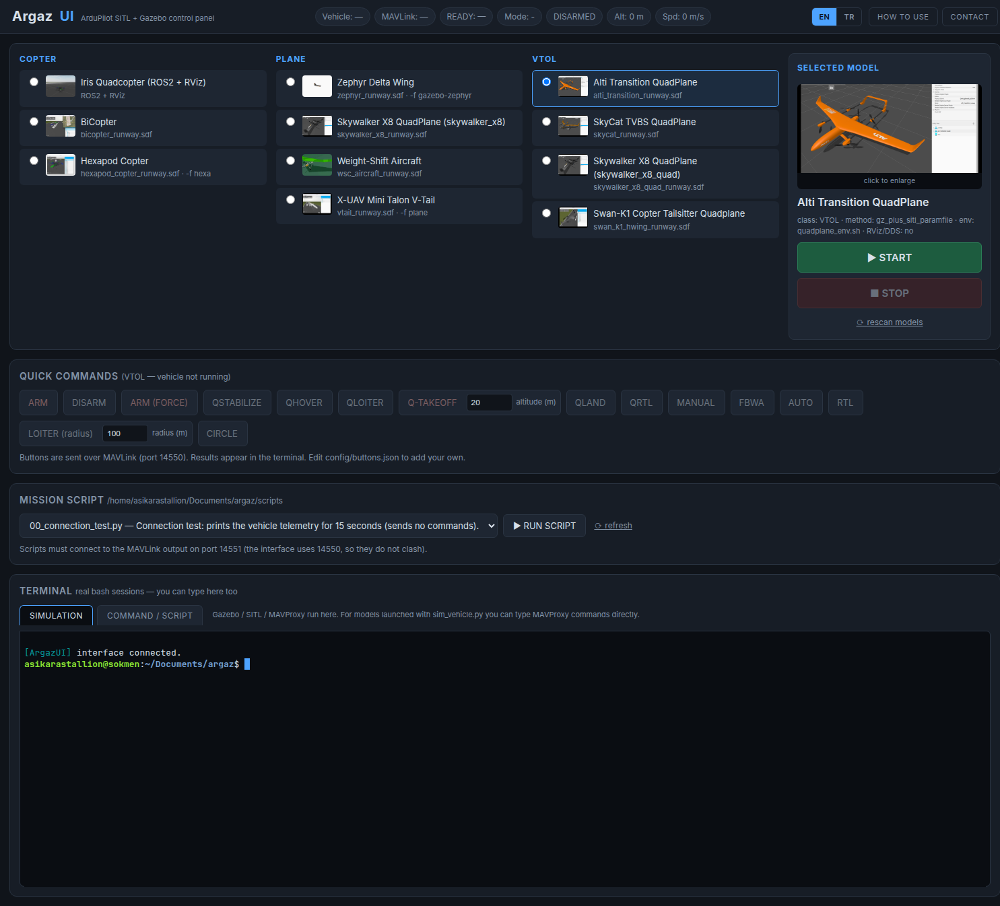

# ArgazUI

**A local control and validation platform for ArduPilot SITL and Gazebo that
turns manual simulation work into repeatable, measurable, evidence-producing
flight runs.**



<!-- STATUS-SUMMARY: generated by argazui status; do not edit between the markers -->
*Verification status: **7** passed, **3** failed, **1** untested of 11 models ([docs/status.md](docs/status.md), generated 2026-08-09T23:06:28Z).*
<!-- /STATUS-SUMMARY -->

Pick a vehicle model, press START, and fly it from a browser. That is the entry
point, not the point. Underneath, every run follows the same path:

```
Launch  ──▶  Control  ──▶  Verify  ──▶  Record  ──▶  Analyse
  │            │             │            │            │
Gazebo +    MAVLink,     procedure     run/ dir     dataflash
SITL, one   not stdin    YAML with    per flight   report with
command                  acceptance                named
                         criteria                  thresholds
```

The difference from a GUI launcher is what happens after the vehicle is in the
air. A procedure states what should happen, acceptance criteria state what
counts as success, the same YAML file backs both the button and the regression
test, and the result is decided by measured vehicle state rather than by an
acknowledgement packet. What a model is claimed to support is generated from
those results, not written by hand.

---

## Why it exists

Running one ArduPilot SITL flight in Gazebo normally means two or three
terminals and the same typing every time:

```bash
source env.sh
gz sim -v4 -r alti_transition_runway.sdf &
cd ardupilot/ArduPlane
sim_vehicle.py -v ArduPlane --model JSON \
    --add-param-file=$SITL_MODELS/Gazebo/config/alti_transition_quad.param --console --map
# ...then remember the right MAVProxy commands to arm and take off
```

That is the visible cost. The larger ones are quieter:

- the launch differs per model, so it is retyped or half-remembered;
- whether the vehicle *actually did* what you asked is judged by watching it;
- logs and parameters are wherever the simulator left them;
- "this model works" is a belief somebody formed once and wrote down.

ArgazUI removes the typing, but the reason it exists is the rest. Runs are
repeatable because the launch is derived from a registry entry; results are
measurable because procedures carry acceptance criteria; and they are traceable
because every flight leaves a directory containing what ran, what the autopilot
recorded, and which firmware it was.

> It does not only make the simulation easier to start. It makes runs
> repeatable, their results measurable, and their evidence traceable.

---

## Core capabilities

### Simulation and control

- One-click launch of any registered model — Gazebo, SITL and MAVProxy in the
  right combination for that airframe, with the exact shell commands typed into
  a visible terminal so nothing is hidden.
- Quick command buttons per vehicle class (ARM, TAKEOFF, mode changes, RTL,
  LAND, Q-modes) sent over **MAVLink**, with real ACKs and the autopilot's own
  rejection text when something is refused.
- Two real interactive bash terminals — one running the simulation with
  MAVProxy still interactive, one free for mission scripts and shell work.
- A READY indicator driven by the autopilot's pre-arm health bit.
- **Live telemetry to PlotJuggler** while the flight is happening: a running
  session mirrors every MAVLink message it receives to a loopback UDP port as
  JSON, which PlotJuggler's UDP Server plots as one series per field. The port
  opens on START and closes on STOP; `plotjuggler_port` configures it.
- Headless operation: with no display, Gazebo runs server-only and MAVProxy
  opens no windows, so the same launch path works over SSH and in a container.

### Verification

- Takeoff and landing **procedures as declarative YAML** per vehicle class
  (`argazui/procedures/`), chosen from capabilities probed off the vehicle.
- **Acceptance criteria that measure state** — altitude reached, mode confirmed
  in a heartbeat, arm state, parameter values, and the attitude envelope the
  aircraft flew through. An ACK is never a pass.
- **Temporal criteria**: `within`, `for` and `never`, measured on the vehicle's
  own clock so they mean the same at speedup 1 and speedup 10. A takeoff that
  reaches altitude and then sinks back is a different result from one that
  holds it, and an instantaneous check cannot tell them apart. See
  [docs/acceptance-criteria.md](docs/acceptance-criteria.md).
- The **button and the regression test execute the same file**, so a passing
  test means a working button.
- Two test tiers with a hard line between them: application-level verification
  and model-level flight verification are never conflated.
- Support status generated from test output into [`docs/status.md`](docs/status.md),
  including **claim-scoped verification**: every procedure, confirmed mode
  change and acceptance criterion listed separately with the run that proves
  it, under a heading that says anything unlisted was not verified.

### Evidence and analysis

- One run directory per START…STOP with the dataflash log, parameter dumps, the
  procedure verbatim, the MAVLink event stream and the console output.
- Post-flight report built from the **autopilot's own dataflash log**, not from
  telemetry.
- Advisories with named thresholds and the ArduPilot page each came from.
- **Quantitative metrics** — time to target altitude, attitude tracking error,
  peak angular rate, time outside the declared envelope, mode-transition
  latency — each with its unit and the log message it came from. They carry no
  threshold of their own and cannot fail a run:
  [docs/metrics.md](docs/metrics.md).
- **An environment fingerprint per run**: ArgazUI and ArduPilot commits, the
  firmware identity, SITL_Models and Gazebo versions, the interpreter, and
  content hashes of the procedures that ran and of the model's configuration.
  A component that cannot be identified is recorded as unknown *with a reason*,
  never guessed: [docs/reproducibility.md](docs/reproducibility.md).
- **Run-to-run regression comparison** with configurable thresholds and CI exit
  codes, which refuses to compare two runs whose fingerprints disagree unless
  told to in so many words: [docs/regression.md](docs/regression.md).

### Operations and reliability

- `argazui doctor` — installation diagnostics; every fix it prints runs
  verbatim when pasted.
- Configurable paths through `argaz.toml`, environment variables or CLI flags;
  no absolute path is baked into the code.
- Session-based process isolation and cleanup that never matches on process
  names.
- Per-model working directories, so SITL state cannot leak between models or
  into the ArduPilot tree.
- Automatic recovery from three specific ARM refusals (below).
- Version-drift detection: the page reports when the running server no longer
  matches the files on disk, and names which layer changed.
- **An engineering documentation portal** in the interface (DOCS in the top
  bar): a persistent tree, a search across every heading, and deep links.
  It holds no prose of its own — every page is a file in this repository or one
  named section of one, and each page says which.

---

## The core idea: support is measured, not claimed

It is easy for a simulation tool to call a model "supported". The model exists,
its configuration loads, SITL starts, the interface responds, and the command
you sent came back with `MAV_RESULT_ACCEPTED`.

None of that proves the vehicle did what you asked.

This is not hypothetical. In v1.0 every fixed-wing model was listed as fully
tested while the TAKEOFF button ran a multirotor's flow — switch to GUIDED,
arm, send `MAV_CMD_NAV_TAKEOFF`. ArduPlane rejects that outright. Nothing
noticed for a year, because nothing looked at the aircraft afterwards.

A second case is sharper, because the criteria existed and were still too weak.
`tailsitter_takeoff` passed three times, at 24.9 m, 23.6 m and 18.3 m: it
reached altitude, stayed armed and reported QHOVER, which were the only three
things checked. When the criteria were extended to measure attitude, the same
procedure on the same frame recorded peak body rates of **1263–1306 °/s** with
control outputs saturated for the whole flight. The aircraft had been tumbling.
Altitude was a side effect of a thrust vector that happened to point roughly
upwards.

ArgazUI's answer:

| | |
|---|---|
| **Procedures describe intent** | a declarative YAML flow per vehicle class |
| **Criteria define success** | measured state, with thresholds written in the procedure |
| **One source** | the button and the test execute the same file |
| **The model is actually flown** | in the tier that can verify it, in Gazebo |
| **Behaviour decides the verdict** | not an ACK, not "it started" |
| **Status is generated** | `docs/status.md` is written by CI from test output |

The distinction this rests on:

> **"The application works" is not the same as "this vehicle model was verified."**

Tier 1 can prove the first. Only tier 2 can prove the second.

---

## Verification model

| | Tier 1 | Tier 2 |
|---|---|---|
| Runs | every push and pull request | nightly, plus manual dispatch |
| Vehicle | ArduPilot SITL's own generic frames | the real `SITL_Models` set in Gazebo |
| Gazebo | no | yes, headless |
| Verifies | procedure logic, capability probing, acceptance evaluation, the HTTP/WebSocket API, the page in a real browser, the live telemetry mirror, `start.sh`, the status generator | that a specific airframe takes off, changes mode in flight and lands |
| Claims about a model | **none** | this is the only tier that may claim one |
| Size | 74 tests | 11 models |

### Tier 1

Real `arducopter` / `arduplane` binaries — never a mock — driven through the
same `ProcedureRunner` the buttons use, plus an end-to-end layer that starts the
real server and drives it in headless Chromium while watching the browser
console. It also covers the parts that only break for a person: the interpreter
`start.sh` picks, whether the commands the interface prints can be pasted, and
whether the status generator maps outcomes to the right words.

It verifies the *application and the procedure logic*. It says nothing about
any airframe, because SITL's generic `quad` frame is not the Skywalker X8.

### Tier 2

Each entry in `models.json` is launched through
`session.build_launch_commands()` — the same function behind the START button —
and flown: takeoff, an in-flight mode change confirmed against the heartbeat,
and a landing. Gazebo matters here because the airframe's real geometry, mass
and control mixing only exist in the model.

A model tier 2 has not flown stays `untested`, however green tier 1 is.

CI is split so this stays affordable: `images.yml` builds the two test images
and publishes them; `tier1.yml` and `tier2.yml` *pull* them and mount the
checkout over the copy inside, so no workflow compiles ArduPilot on a push.
`status.yml` regenerates the status table afterwards, including when a run
failed.

---

## Evidence produced by every flight

One directory per START…STOP, under `runs/<UTC-time>_<model_id>/`:

| Artefact | Question it answers |
|---|---|
| `scenario.yaml` | **What was executed** — the procedure files byte-for-byte |
| `result.json` | **What passed and why** — every step and acceptance criterion |
| `console.log` | **What the simulation printed** |
| `mavlink_events.jsonl` | **What the vehicle reported** — modes, arm/disarm, ACKs, autopilot messages, 1 Hz state |
| `<NNNNNNNN>.BIN` | **What the autopilot recorded** — its own dataflash log |
| `params_full.txt` / `params_diff.txt` | **Configuration state** — everything, and what differs from firmware default |
| `report.md` / `report.json` / `plots/` | **Post-flight interpretation**, including the metrics |
| `fingerprint.json` | **What produced this result** — commits, firmware identity, simulator versions, and content hashes of the procedures and the model configuration |
| `regression.json` / `regression.md` | **How it compares to a baseline**, once compared |
| `versions.txt` | **Reproducibility context** — ArduPilot SHA, Gazebo, ArgazUI, interpreter |

The report is built from the dataflash log rather than from telemetry, so it
reflects what the autopilot itself recorded at full rate. It contains a mode
timeline, arm/disarm intervals, an altitude profile, demanded-versus-achieved
roll and pitch error, EKF innovation test ratios, vibration with accelerometer
clipping counts, battery, the parameters the run changed, and notable autopilot
messages. Two plots (altitude, attitude) are produced when matplotlib is
installed; without it the report is complete except for the PNGs and says so.

`params_diff.txt` compares each value against the firmware default the
autopilot records beside it, so the comparison is the vehicle's own statement
rather than a diff against a `.param` file.

Advisories — vibration, EKF innovations, attitude tracking, accelerometer
clipping, a firmware/checkout mismatch — are reported with the threshold that
triggered them and never change a procedure's verdict. A noisy airframe must
not mark a working takeoff as broken, and a real acceptance failure must not
hide among health warnings.

**Metrics** are a third kind of output and cannot fail a run either: measured
quantities with no threshold of their own, which acquire one only when compared
against a named baseline. A metric that could not be derived is written as
`null` with a stated reason rather than omitted — an absent row and a
measurement that could not be made look identical, and only one of them is a
fact. See [docs/metrics.md](docs/metrics.md).

Comparing two runs is refused unless their fingerprints agree on the model, the
procedures, the ArduPilot commit and the firmware that flew — including when
one of those is *unknown*, which is not evidence that they match. See
[docs/regression.md](docs/regression.md).

The **Flight Runs** panel lists the five most recent runs in the browser — with
the report, its plots, a `.BIN` download and a copyable `MAVExplorer.py`
command — and opens the rest on demand. From the shell:

```bash
python3 -m argazui runs                    # list recorded runs
python3 -m argazui report                  # rebuild the newest run's report
python3 -m argazui report some/other.BIN   # analyse any dataflash log
python3 -m argazui status --runs runs      # regenerate docs/status.md

# compare a run's metrics against a baseline: exit 0 clean, 1 regression,
# 2 the two runs could not be compared
python3 -m argazui compare runs/<current> --baseline runs/<baseline>
```

`runs/` is gitignored — it is the output of flying, not source. Point
`runs_root` in `argaz.toml` somewhere else if you prefer.

---

## Architecture

```
browser ──WebSocket──┐
                     │            ┌── pty #1 ── bash ── gz sim + sim_vehicle.py
   FastAPI (127.0.0.1:8770) ──────┤                     └── MAVProxy (interactive)
                     │            └── pty #2 ── bash ── your mission scripts
                     │
                     └──MAVLink UDP 14550──▶ the vehicle   (scripts use 14551)
```

Three design decisions came out of testing rather than planning.

### Why commands use MAVLink, not MAVProxy stdin

On the ROS 2 launch path MAVProxy is started with `--non-interactive` and never
reads stdin, so typing `mode guided` into that terminal does nothing. MAVLink
works identically on both launch paths and returns ACKs, so the buttons use it
and report the real result — including the autopilot's rejection reason.

### Why there are two terminals

The simulation occupies the shell's foreground, and that is required: a
background process cannot read stdin (it stops with `SIGTTIN`), and MAVProxy's
interactivity depends on it. A second shell is opened so mission scripts and
manual commands remain possible.

### How process cleanup works

`pkill -f <pattern>` can match the command line of the shell running it. Each
terminal is instead started in its own session (`start_new_session=True`), and
STOP scans `/proc` for the process groups belonging to that session, then
terminates them with `os.killpg` in SIGINT → SIGTERM → SIGKILL order. SIGINT
comes first so SITL flushes and closes its dataflash log before exiting.
Matching uses kernel-reported SID/PGID, so killing an unrelated process is not
possible.

Each model also runs in its own working directory (`argazui/run/<model_id>/`),
so SITL's `eeprom.bin`, logs and terrain cache never touch the ArduPilot tree
and models cannot corrupt each other's stored parameters.

---

## Requirements

ArgazUI is a front end for an existing simulation setup. It does **not** bundle
these and expects them to sit next to it:

| Component | Notes |
|---|---|
| [ArduPilot](https://github.com/ArduPilot/ardupilot) | built SITL binaries (`arducopter`, `arduplane`) |
| [ardupilot_gazebo](https://github.com/ArduPilot/ardupilot_gazebo) + ROS 2 workspace | the Gazebo↔SITL physics bridge; the workspace is needed for the `ros2_launch` model |
| [SITL_Models](https://github.com/ArduPilot/SITL_Models) | Gazebo model, world and parameter files |
| Gazebo Harmonic, ROS 2 Jazzy | tested combination |
| Python 3.12 | `fastapi`, `uvicorn`, `wsproto`, `pymavlink`, `pyyaml`; `pytest` and `playwright` for the suite |

Verified on Ubuntu 24.04 with Gazebo Harmonic and ROS 2 Jazzy.

### Expected layout

`argaz.toml` describes the simulation installation. Relative values are
resolved from that file, so this layout is a convenient starting point rather
than a requirement:

```
argaz/
├── env.sh                 # ROS 2 + Gazebo environment (yours)
├── quadplane_env.sh       # adds the SITL_Models resource paths (yours)
├── ardupilot/             # cloned separately  (not in this repo)
├── ardu_ws/               # cloned separately  (not in this repo)
├── SITL_Models/           # cloned separately  (not in this repo)
├── scripts/               # your mission scripts
└── argazui/               # this tool
```

The three upstream trees are excluded via `.gitignore` — together they exceed
10 GB and belong to their own projects.

---

## Quick start

```bash
git clone https://github.com/asikarastallion/argaz.git
cd argaz
cp argaz.toml.example argaz.toml       # edit paths if this is not your layout
cd argazui

# one-off: fetch the model preview images from the upstream ArduPilot docs
python3 -m argazui.fetch_images

./start.sh doctor                      # list every missing prerequisite
./start.sh
```

Then open **http://127.0.0.1:8770**.

`start.sh` locates a Python interpreter that has the required packages — it
never installs into a distribution-managed one — and runs the critical `doctor`
checks before opening the server. Missing Gazebo or ROS 2 does not stop it
starting; it reports them and tells you which models cannot be launched.

`doctor` is part of the workflow, not an afterthought:

```bash
python3 -m argazui doctor              # human-readable report
python3 -m argazui doctor --json       # machine-readable
python3 -m argazui doctor --tier tier1 # skip the Gazebo/ROS 2 checks
```

It verifies the SITL binaries by running them, the model/ROS/Gazebo
installation, the Python packages, that the run directory is writable, and
HTTP/UDP port conflicts. It only reports state; it never installs anything or
modifies an upstream tree.

### Configuration resolution

Settings are resolved in this order, first match winning:

1. CLI option (`--argaz-root`, `--port`, `--mavlink-port`, …)
2. environment variable (`ARGAZ_ROOT`, `ARGAZ_ARDUPILOT_ROOT`, `ARGAZ_PORT`, …)
3. `argaz.toml`
4. auto-detection from this checkout

```bash
python3 -m argazui --mavlink-port 14600
python3 -m argazui --argaz-root /opt/simulation
```

See [`argaz.toml.example`](argaz.toml.example) for every setting.

---

## Verification status

The support table is **generated**, not written:

### → [docs/status.md](docs/status.md)

`status.yml` regenerates it after a tier-1 or tier-2 run — including a failing
one, because a failure is a result — and commits it. A hand edit is overwritten
by the next CI run. Each row names the procedures flown, the firmware they flew
on, when, and which tier verified it. The summary line under the banner at the
top of this file is generated by the same command.

A result can only be one of four words:

| result | meaning |
|---|---|
| `passed` | flown in Gazebo; every acceptance criterion held |
| `failed` | flown in Gazebo; a step or criterion did not hold |
| `flaky` | flown in Gazebo; passed only on the retry, never reported as `passed` |
| `untested` | **not yet verified by a machine** |

`untested` is not `failed`. It does not mean broken and it does not mean
working — it means nothing has proven anything, which is a more useful
statement than a tick somebody typed. A model that was skipped, that has no
matching procedure, or that tier 2 has not reached is `untested`.

The registry currently holds 11 models across Copter, Plane and VTOL classes.
Not all of them pass; the generated table is the authority on which. Rover, boat
and walking-robot models in `SITL_Models` are intentionally out of scope.

---

## Automatic ARM recovery

A rejected ARM is usually not a bug — the vehicle is not ready yet. ArgazUI
handles three specific refusals that occurred during real testing. It does not
attempt to work around arbitrary ARM failures, and a refusal it does not
recognise is reported with the autopilot's own wording.

| Autopilot says | What ArgazUI does |
|---|---|
| `AHRS: waiting for home`, `Accels inconsistent`, `EKF …` and similar transients | Retries for up to 35 s until the vehicle settles |
| `Pitch (RC2) is not neutral` | Reads that channel's `RC*_TRIM` and centres the stick on it, then retries. The model's parameters are untouched. |
| `3D Accel calibration needed` | Runs a simple accelerometer calibration (`accelcalsimple`), which is valid in SITL because the vehicle sits level |

**Known exception — Swan-K1.** This model still requires `ARM (FORCE)`. Its
parameter file is a full dump from a real flight controller; two of its
contradictions are corrected at boot through `sitl_param_overrides`, but the
remaining mag-field and yaw warnings come from the airframe being a tailsitter
— it stands nose-up while those checks assume a level vehicle. This is a
documented limitation, not a general capability.

---

## Mission scripts

Drop a `pymavlink` script into `scripts/` and it appears in the dropdown. The
two MAVLink ports are separated deliberately:

| Port | Belongs to | Direction |
|---|---|---|
| **14550** | the ArgazUI interface — status chips and the command buttons | ArgazUI listens |
| **14551** | **your mission scripts** | your script listens |
| **14552** | the live telemetry mirror | ArgazUI **sends**; PlotJuggler listens |

Two listeners cannot share one UDP port, and a script that took 14550 would
silently disconnect the interface. ArgazUI exports
`ARGAZ_MAVLINK_SCRIPT_PORT` into the script terminal, so a script can read it
rather than hard-code the number:

```python
import os
from pymavlink import mavutil

PORT = int(os.environ.get("ARGAZ_MAVLINK_SCRIPT_PORT", "14551"))
conn = mavutil.mavlink_connection(f"udpin:127.0.0.1:{PORT}")
conn.wait_heartbeat(timeout=30)
```

Two examples are included: `00_connection_test.py` (read-only telemetry) and
`10_copter_takeoff_and_rtl.py` (GUIDED takeoff → RTL).

---

## Configuration files

`argaz.toml` configures external roots and ports; the JSON files configure the
interface. No path is hard-coded to a user directory.

| File | Purpose |
|---|---|
| `argaz.toml` | `ardupilot_root`, `sitl_models_root`, `ardu_ws_root`, `env_script`, `runs_root`, ports (`port`, `mavlink_port`, `script_mavlink_port`, `plotjuggler_port`); copy from `argaz.toml.example` on another machine |
| `argazui/config/models.json` | Model registry — regenerate with `python3 -m argazui.scan_models --force`; entries marked `_manually_added` survive a rescan |
| `argazui/config/buttons.json` | Quick command buttons per vehicle class, with optional Turkish labels |
| `argazui/procedures/*.yaml` | Takeoff and landing procedures; the schema is documented in [`SCHEMA.md`](argazui/procedures/SCHEMA.md) |

The scanner reads `SITL_Models/Gazebo/docs/*.md` and extracts the documented
`gz sim` and `sim_vehicle.py` invocations, classifies Plane versus VTOL from
`Q_ENABLE` in the referenced parameter file, and picks up "copy this `.lua`
script" prerequisites. It works from upstream documentation; it does not
introspect the models themselves, and an entry it cannot classify is marked for
review rather than guessed at.

Procedure selection does not trust the registry. Which takeoff a vehicle gets
is decided from capabilities **probed off the aircraft over MAVLink**
(`Q_ENABLE`, `Q_TAILSIT_ENABLE`, `Q_OPTIONS`), because `models.json` can be
wrong: one model registered as a plain QuadPlane sets `Q_TAILSIT_ENABLE=1` in
its parameter file and is really a tailsitter.

---

## Docker: clean-environment validation

The images exist to prove the project runs somewhere other than the machine it
was written on, and to give CI something reproducible to pull. They are
**validation environments, not a deployment target** — there is no orchestration,
no persistence and no exposed service.

| Image | Contains | Deliberately omits |
|---|---|---|
| `Dockerfile.tier1` | ArduPilot SITL built from a pinned commit, ArgazUI, the test suite, headless Chromium | Gazebo, ROS 2, the model set |
| `Dockerfile.tier2` | the above plus Gazebo Harmonic, ROS 2 Jazzy, `ardupilot_gazebo` and `SITL_Models` | — |

```bash
docker compose run --build --rm doctor-tier1   # prerequisite report, no Gazebo
docker compose run --build --rm doctor-tier2   # full prerequisite report
docker compose run --build --rm tier1          # the tier-1 suite in a clean container
```

Both images install their Python dependencies into a virtual environment rather
than the system interpreter, and pin ArduPilot to an exact commit so two builds
of the same Dockerfile fly the same autopilot. Definitions are under
[`docker/`](docker/).

---

## Documentation

All of it is also in the interface, under **DOCS** in the top bar: a tree, a
search across every heading, and deep links. The portal serves these files —
it does not copy them — so there is exactly one place to edit any of it.

| Document | Contents |
|---|---|
| [`argazui/USAGE.md`](argazui/USAGE.md) | The full guide: every panel, launch methods, adding models/buttons/scripts. Also in-app under **HOW TO USE**, in English and Turkish. |
| [`argazui/procedures/SCHEMA.md`](argazui/procedures/SCHEMA.md) | The procedure format: steps, conditions, acceptance criteria, declared overrides, temporal criteria |
| [`docs/verification-model.md`](docs/verification-model.md) | What a green result claims — and, at greater length, what it does not |
| [`docs/acceptance-criteria.md`](docs/acceptance-criteria.md) | Conditions and the temporal shapes `within` / `for` / `never` |
| [`docs/metrics.md`](docs/metrics.md) | The metric catalogue: units, scopes and source signals |
| [`docs/regression.md`](docs/regression.md) | Baseline versus current, thresholds, and the CI contract |
| [`docs/reproducibility.md`](docs/reproducibility.md) | The environment fingerprint, field by field |
| [`docs/runs-and-evidence.md`](docs/runs-and-evidence.md) | What a run directory contains and why each file is in it |
| [`docs/lifecycle.md`](docs/lifecycle.md) | START to STOP: what is launched and how it is shut down |
| [`docs/ci.md`](docs/ci.md) | Which workflow runs which tier, and what each may claim |
| [`docs/diagnostics.md`](docs/diagnostics.md) | What `argazui doctor` checks and what a failure means |
| [`docs/testing.md`](docs/testing.md) | Running each tier, and what a skip is worth |
| [`docs/status.md`](docs/status.md) | Generated model verification status and per-claim results |
| [`docs/manual-checklist.md`](docs/manual-checklist.md) | What still has to be checked by hand, with each step marked covered or not |
| [`TROUBLESHOOTING.md`](TROUBLESHOOTING.md) *(Turkish)* | Building the underlying environment: apt conflicts, Gazebo/ROS 2 mismatches, the GTK/locale variables that crash GUI apps under a snap terminal |
| [`CHANGELOG.md`](CHANGELOG.md) | Release history, including what earlier versions got wrong |

Every `docs/*.md` page above has a Turkish twin at `docs/<name>.tr.md`, and the
portal serves it in Turkish mode. The pages that are sections of `README.md` or
`USAGE.md` have no Turkish source, and the portal says so above the English
text rather than letting it pass unremarked — forking every repository document
into a second language would recreate the duplicate-source problem the portal
exists to avoid.

---

## Scope

### Implemented in v1.3

Temporal acceptance criteria (`within` / `for` / `never`, procedure schema 2)
measured on the vehicle's clock; quantitative flight metrics derived from the
dataflash evidence; a machine-readable environment fingerprint per run;
run-to-run regression comparison with configurable thresholds and CI exit
codes; claim-scoped verification in the status table; and an engineering
documentation portal in the interface.

### Implemented in v1.2

Live telemetry streaming: a running session mirrors every MAVLink message it
receives to a loopback UDP port as JSON, which PlotJuggler plots in real time
alongside the post-flight report v1.1 already produced. The port opens on START
and closes on STOP, and `plotjuggler_port` configures it.

### Implemented in v1.1

Class-based takeoff and landing procedures with measurable acceptance criteria;
capability-based procedure selection; declared and restored parameter
overrides; run artefacts and post-flight reports; installation diagnostics and
relocatable configuration; a test suite that flies real SITL in a real browser;
two CI tiers; machine-generated support status; version-drift detection.

### Not implemented, and not started

These are listed so they are not mistaken for features:

- multi-vehicle / swarm simulation
- HITL (a bridge to real hardware)
- scenario execution — the `mission:` and `failures:` keys are *reserved* in
  the procedure schema and rejected at load time until a version implements them
- failure injection (wind, GPS loss, motor failure through `SIM_*`)
- authentication, remote access, graphical mission planning, telemetry
  dashboards (MAVProxy's map and console cover part of the last two; ArgazUI
  mirrors live telemetry for PlotJuggler rather than plotting it itself)

### Known limitations

Current failures and gaps are recorded rather than omitted: see
[`docs/status.md`](docs/status.md) for per-model results,
[`CHANGELOG.md`](CHANGELOG.md#known-limits) for the release's known limits, and
[`docs/manual-checklist.md`](docs/manual-checklist.md) for what no test covers
— most notably that models are flown headless, so no test has ever inspected a
rendered Gazebo frame.

---

## Technical stack

Python 3.12 · FastAPI · WebSockets (`wsproto`) · `pymavlink` · PyYAML ·
xterm.js (vendored) · pytest · Playwright · ArduPilot SITL · MAVProxy ·
Gazebo Harmonic · ROS 2 Jazzy · Docker · GitHub Actions

Localhost only, no authentication, no telemetry, no CDN.

---

## License

ArgazUI is released under the **MIT License** — see [LICENSE](LICENSE).

ArduPilot, `ardupilot_gazebo` and `SITL_Models` (all GPL-3.0) are **not
redistributed here**. They are expected to exist as separate local
installations, which ArgazUI launches as external processes and reads
documentation and parameter files from. Model preview images are downloaded
from the upstream documentation at setup time by `fetch_images.py` rather than
committed.

`pymavlink` (LGPL-3.0) is used as an unmodified, separately installed pip
dependency. `xterm.js` (MIT) is vendored under `argazui/static/vendor/`.

Every dependency and upstream project, with its licence and notice, is listed
in [THIRD_PARTY_NOTICES.md](THIRD_PARTY_NOTICES.md).

---

## Contact

**M. Serdar Sökmen**

- E-mail — [mserdarsokmen@gmail.com](mailto:mserdarsokmen@gmail.com)
- LinkedIn — [linkedin.com/in/mserdarsokmen](https://www.linkedin.com/in/mserdarsokmen)
- GitHub — [github.com/asikarastallion](https://github.com/asikarastallion)
